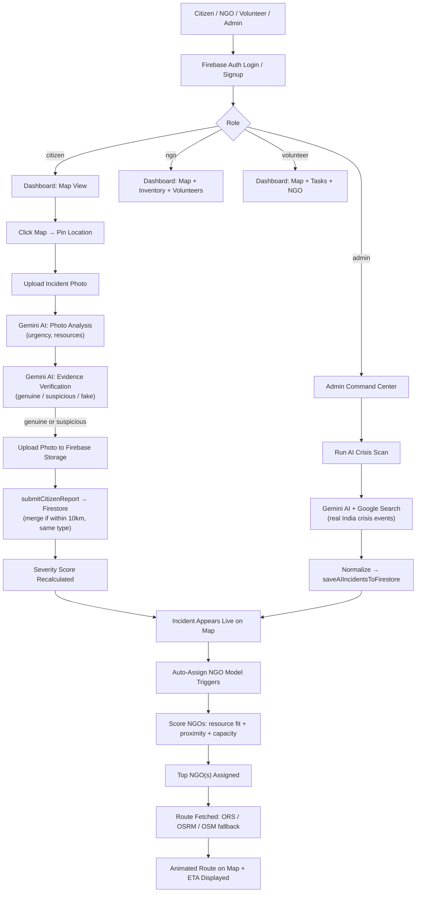
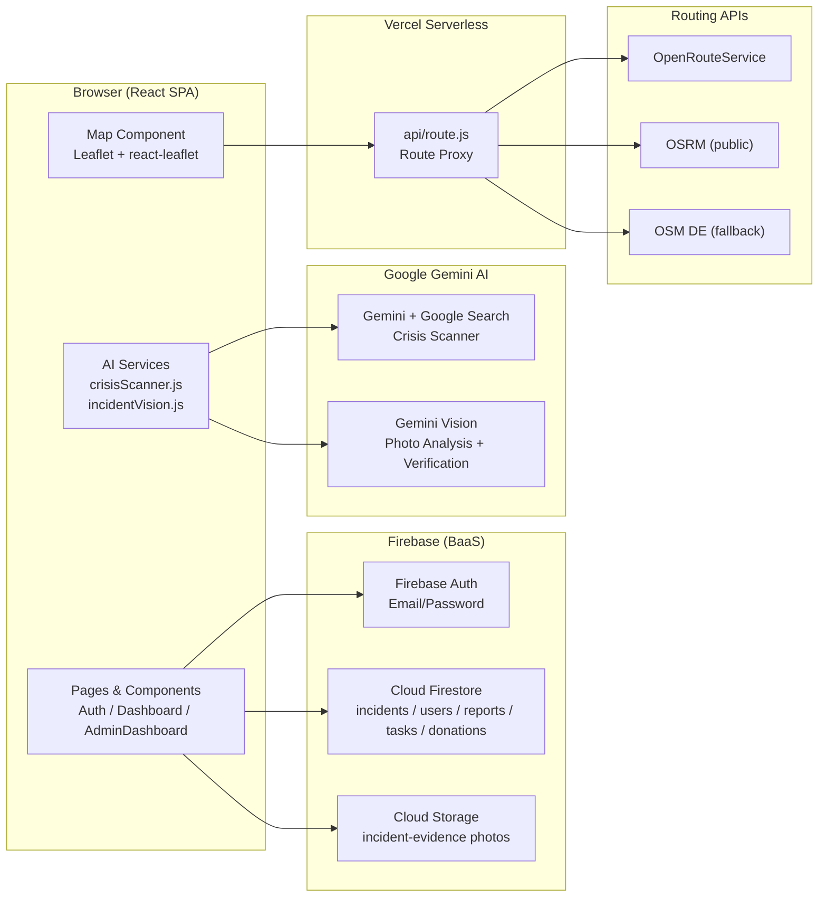

# ResQAI

> **AI-Powered Crisis Intelligence Platform** — ensuring the right help reaches the right place at the right time.

ResQAI is a real-time disaster response coordination web application built for India. It connects citizens who report emergencies, NGOs who respond on the ground, volunteers who assist, and administrators who coordinate the full picture — all augmented by Google Gemini AI for intelligent crisis scanning, photo analysis, and NGO auto-assignment.


---

## Table of Contents

1. [Project Overview](#project-overview)
2. [Features](#features)
3. [How It Works](#how-it-works)
4. [Architecture](#architecture)
5. [Technology Stack](#technology-stack)
6. [Project Structure](#project-structure)
7. [Prerequisites](#prerequisites)
8. [Installation](#installation)
9. [Environment Variables](#environment-variables)
10. [Running the Project](#running-the-project)
11. [Usage](#usage)
12. [API Documentation](#api-documentation)
13. [Authentication & Security](#authentication--security)
14. [UI / User Interface](#ui--user-interface)
15. [Configuration](#configuration)
16. [Available Scripts](#available-scripts)
17. [Development Guide](#development-guide)
18. [Troubleshooting](#troubleshooting)
19. [Contributing](#contributing)
20. [Project Status](#project-status)
21. [License](#license)
22. [Author](#author)

---

## Project Overview

### Purpose

During natural disasters — floods, earthquakes, cyclones, fires, landslides — coordinating relief efforts is chaotic. Citizens have no easy way to report emergencies. NGOs don't know where to go, what resources to bring, or who else is already responding. Volunteers have no visibility into tasks. Admins have no single view of the evolving situation.

### Problem Statement

Manual disaster coordination suffers from:
- **Fragmented information** — emergency reports scattered across calls, social media, and word of mouth
- **Delayed resource dispatch** — no objective way to prioritize which incident is most critical
- **Misinformation** — unverified or fabricated incident photos wasting emergency resources
- **Inefficient NGO matching** — NGOs not knowing which incidents need their specific resources

### Solution

ResQAI solves this with a **role-based real-time platform** where:
- **Citizens** pin incidents on a live map, upload photo evidence, and the AI instantly assesses urgency and required resources
- **NGOs** see real-time incidents sorted by severity, self-assign, manage volunteers and inventory
- **Volunteers** join NGOs, view assigned tasks, and track their impact
- **Admins** run AI-powered crisis scans of real India events, trigger intelligent NGO auto-assignment, and manage the entire network from a command center

### Target Users

- Citizens in disaster-prone regions in India
- NGOs and relief organizations
- Volunteers wanting to contribute meaningfully
- Government or independent disaster response coordinators

---

## Features

### 🗺️ Live Interactive Incident Map
An interactive Leaflet map shows all reported incidents in real time. Incidents are color-coded by severity. Clicking on a marker reveals detailed popup info including AI analysis, casualty stats, logistics needs, and help status. Citizens can click anywhere on the map to pin a new incident location.

### 📸 AI Photo Analysis (`incidentVision.js`)
When a citizen submits a report, the uploaded incident photo is sent to Google Gemini's vision models. The AI returns a structured response with urgency level, confidence score, and a prioritized list of required resources (food packets, medical kits, rescue teams, etc.). Falls back to disaster-type templates if the model is unavailable.

### 🔍 AI Evidence Verification
Before a citizen report is saved, ResQAI runs a second AI pass to verify whether the uploaded photo actually matches the reported disaster type and location context. The system evaluates both the model's assessment and file metadata heuristics (filename, file size, image age). Photos flagged as "fake" are rejected with an explanation. Verdicts include `genuine`, `suspicious`, and `fake`.

### 🤖 AI Crisis Scanner (`crisisScanner.js`)
Admins can trigger a Gemini AI + Google Search powered scan of real-world crises across India in the last 30 days. The AI returns structured JSON reports for up to 10+ distinct events including title, disaster type, severity level, casualty estimates, logistics needs, geolocation coordinates, and AI urgency/confidence analysis. Reports are automatically saved to Firestore and appear live on the map. Duplicate detection prevents re-saving the same event on repeated scans.

### 📊 AI Severity Scoring
Every incident — whether citizen-reported or AI-generated — receives a numeric severity score (0–100) calculated from a multi-factor model: disaster type baseline, report count accumulation, AI urgency weight, AI confidence weight, and required resource priority/quantity weighting.

### 🧮 Intelligent NGO Auto-Assignment
When an incident has no assigned NGOs, the system automatically scores all registered NGOs on three dimensions: resource fit (how well the NGO's inventory matches the incident's predicted resource needs), proximity (Haversine distance), and general capacity. The top-scoring NGOs are assigned. Admins can also trigger manual auto-assignment at any time.

### 📍 Live Route Visualization on Map
When an NGO is assigned to an incident, the map renders the road route from the NGO's location to the incident. Routes are fetched via a backend-proxied API (OpenRouteService → OSRM → OSM DE fallback chain). An animated moving aid marker travels along the route to visually represent the dispatch. Real-time ETA is estimated and displayed.

### 🔐 Role-Based Authentication
Firebase Auth powers registration and login. Users register as one of three roles: **Citizen**, **NGO**, or **Volunteer**. Each role gets a distinct dashboard experience. An admin role is handled via a dedicated email check and Firestore role field. Route guards redirect unauthorized users.

### 👥 Volunteer Management
Volunteers can join an NGO at signup or from the dashboard. They can also leave and join a different NGO. NGOs see all their joined volunteers and can assign tasks to individual volunteers against specific incidents. Volunteers view and complete their tasks in real time.

### 📦 NGO Inventory Management
NGOs track their resource inventory across four categories: food packets, clothing sets, supply packs, and medical kits. Inventory can be incremented or decremented from the dashboard. The inventory values directly influence which NGO gets matched to incidents via the scoring model.

### 💰 Donation System
Any user (citizen, volunteer, NGO) can make a donation. The donation form supports preset amounts and custom amounts, optional incident targeting, and a message. Donation records are stored in Firestore. Admins can see total donations in real time.

### 🚨 Floating Severity Alerts
When any incident crosses a threshold of 5+ reports and severity > 50, a dismissible floating alert is shown to all logged-in users, regardless of their current dashboard tab.

### 🏛️ Admin Command Center
The admin dashboard provides a full operational overview: total incidents, active crises, resolved incidents, NGO count, volunteer count, and donation totals via stat cards. Separate tabs give access to the command map, incident list with NGO assignment controls, AI scanner, NGO directory with inventory and volunteer counts, and a grouped volunteer directory.

---

## How It Works



### Step-by-Step Summary

1. **User registers/logs in** via Firebase Auth, selecting their role (citizen, NGO, volunteer).
2. **Citizens** use the interactive map to click a location, fill in the incident details, and upload a photo.
3. **AI analyzes the photo** (urgency, required resources) and **verifies its authenticity** — fake photos are rejected.
4. **The report is saved** to Firestore. If a matching incident already exists within 10 km (same disaster type), reports are merged and severity is recalculated.
5. **NGO auto-assignment** runs automatically — NGOs are scored on resource fit, proximity, and capacity. Top-scoring NGOs are assigned.
6. **The assigned NGO's route** to the incident is fetched from a routing API and displayed as an animated polyline on the map.
7. **Admins** can also run a Gemini AI + Google Search **crisis scan** to pull real-world India disaster data directly into the platform.
8. **NGOs** manage their inventory, see their assignments, coordinate volunteers, and mark situations as resolved.
9. **Volunteers** receive tasks from their NGO and mark them complete.

---

## Architecture



### Component Breakdown

| Component | Description |
|---|---|
| **React SPA** | Frontend application in `src/`. All pages, components, and state management live here. |
| **Firebase Auth** | Handles user registration (citizen / NGO / volunteer / admin) and session management via `onAuthStateChanged`. |
| **Cloud Firestore** | Primary NoSQL database. Real-time `onSnapshot` listeners keep all dashboards live. Collections: `incidents`, `users`, `reports`, `tasks`, `donations`. |
| **Cloud Storage** | Stores incident evidence photos uploaded by citizens. URLs are written back to the Firestore incident record. |
| **Crisis Scanner** | Calls Gemini AI with the `googleSearch` tool to discover real India crisis events and returns structured JSON. |
| **Incident Vision** | Sends incident photos to Gemini Vision API for urgency/resource prediction and evidence authenticity verification. |
| **Route Proxy** (`api/route.js`) | Vercel serverless function that proxies routing requests to ORS / OSRM / OSM DE, preventing CORS issues and hiding the API key. |
| **Leaflet Map** | Renders incidents, NGO locations, road routes, animated aid vehicles, and user position on an OpenStreetMap-based tile layer. |

---

## Technology Stack

| Category | Technology | Purpose |
|---|---|---|
| **Frontend** | React 19 | UI component framework |
| **Frontend** | React Router DOM 7 | Client-side SPA routing (`/`, `/dashboard`, `/admin`) |
| **Frontend** | Vite 8 | Dev server and production build tool |
| **Mapping** | Leaflet + react-leaflet | Interactive map rendering, markers, polylines, popups |
| **UI Icons** | lucide-react | Icon library used across all dashboards |
| **Database** | Cloud Firestore | Real-time NoSQL database |
| **Authentication** | Firebase Auth | Email/password authentication |
| **File Storage** | Firebase Cloud Storage | Evidence photo uploads |
| **AI / LLM** | Google Gemini AI (`@google/genai`) | Crisis scanning via Google Search tool |
| **AI / Vision** | Google Gemini Vision (REST API) | Incident photo analysis and evidence verification |
| **Routing** | OpenRouteService / OSRM / OSM DE | Road route calculation for NGO dispatch |
| **Deployment** | Vercel | SPA hosting + serverless function for route proxy |
| **Linting** | ESLint 10 (flat config) | Code quality enforcement |

---

## Project Structure

```text
ResQAI-/
├── api/
│   └── route.js                  # Vercel serverless route proxy (ORS/OSRM/OSMDE)
├── public/
│   ├── favicon.svg
│   └── icons.svg
├── src/
│   ├── assets/
│   │   ├── hero.png              # Hero image asset
│   │   ├── incident-logo.svg     # Map marker icon for incidents
│   │   └── ngo-logo.svg          # Map marker icon for NGOs
│   ├── components/
│   │   ├── DonationForm.jsx      # Preset/custom donation amount form
│   │   ├── FloatingAlert.jsx     # Auto-dismissing severity alert banner
│   │   ├── Map.jsx               # Full Leaflet map with routes, markers, animation
│   │   ├── Modal.jsx             # Generic modal overlay wrapper
│   │   ├── Navbar.jsx            # Top bar: user name, role badge, logout
│   │   ├── SeverityBar.jsx       # Gradient severity progress bar (0–100)
│   │   ├── StatCard.jsx          # Metric card for admin overview
│   │   └── TabBar.jsx            # Sidebar navigation with role-specific tabs
│   ├── contexts/
│   │   └── AuthContext.jsx       # Global auth state via React context
│   ├── firebase/
│   │   ├── config.js             # Firebase app init; exports auth, db, storage
│   │   └── firestoreHelpers.js   # All Firestore CRUD, severity scoring, NGO model
│   ├── pages/
│   │   ├── Auth.jsx              # Login / signup with role-specific fields
│   │   ├── Dashboard.jsx         # Citizen / NGO / Volunteer dashboard
│   │   └── AdminDashboard.jsx    # Admin command center
│   ├── services/
│   │   ├── crisisScanner.js      # Gemini AI + Google Search crisis ingestion
│   │   └── incidentVision.js     # Gemini Vision photo analysis + verification
│   ├── App.jsx                   # Root routing (/, /dashboard, /admin)
│   ├── App.css                   # Minimal overrides
│   ├── index.css                 # Full design system (tokens, layout, components)
│   └── main.jsx                  # React entry point
├── DataExtract.js                # Standalone Node.js Gemini query script (dev utility)
├── eslint.config.js              # Flat ESLint configuration
├── index.html                    # SPA shell with Google Fonts + Leaflet CSS
├── package.json
├── vercel.json                   # Vercel rewrite rules for SPA + API
└── vite.config.js                # Vite config + local route proxy dev middleware
```

---

## Prerequisites

Before setting up ResQAI locally, ensure you have the following installed:

| Requirement | Version | Notes |
|---|---|---|
| **Node.js** | v18+ | Required for Vite and npm |
| **npm** | v9+ | Comes with Node.js |
| **Firebase Project** | — | Needs Firestore, Auth (Email/Password), and Storage enabled |
| **Google Gemini API Key** | — | Required for AI crisis scanner and photo analysis |
| **OpenRouteService API Key** | — | Optional; OSRM/OSM DE are used as free fallbacks |

---

## Installation

### 1. Clone the Repository

```bash
git clone https://github.com/Aditya-londhe-77/ResQAI-.git
cd ResQAI-
```

### 2. Install Dependencies

```bash
npm install
```

### 3. Set Up Environment Variables

Create a `.env` file in the project root:

```bash
cp .env.example .env   # if an example exists, otherwise create manually
```

Populate it with your credentials (see [Environment Variables](#environment-variables) below).

---

## Environment Variables

Create a `.env` file in the project root with the following variables:

```env
# Firebase Configuration (from your Firebase project settings)
VITE_FIREBASE_API_KEY=your_firebase_api_key
VITE_FIREBASE_AUTH_DOMAIN=your_project_id.firebaseapp.com
VITE_FIREBASE_PROJECT_ID=your_project_id
VITE_FIREBASE_STORAGE_BUCKET=your_project_id.appspot.com
VITE_FIREBASE_MESSAGING_SENDER_ID=your_sender_id
VITE_FIREBASE_APP_ID=your_app_id

# Gemini AI (Google AI Studio)
VITE_GEMINI_API_KEY=your_gemini_api_key
VITE_GEMINI_MODEL=gemini-2.0-flash   # optional fallback model name

# Routing (optional — OSRM/OSM DE are used as free fallbacks)
VITE_OPENROUTESERVICE_API_KEY=your_ors_api_key
```

> [!CAUTION]
> Never commit your `.env` file to version control. It is already listed in `.gitignore`. Keep your Firebase and Gemini API keys private.

### Variable Reference

| Variable | Required | Description |
|---|---|---|
| `VITE_FIREBASE_API_KEY` | ✅ | Firebase project web API key |
| `VITE_FIREBASE_AUTH_DOMAIN` | ✅ | Firebase Auth domain |
| `VITE_FIREBASE_PROJECT_ID` | ✅ | Firebase project ID |
| `VITE_FIREBASE_STORAGE_BUCKET` | ✅ | Firebase Storage bucket name |
| `VITE_FIREBASE_MESSAGING_SENDER_ID` | ✅ | Firebase Messaging sender ID |
| `VITE_FIREBASE_APP_ID` | ✅ | Firebase app ID |
| `VITE_GEMINI_API_KEY` | ✅ | Google AI Studio API key for Gemini |
| `VITE_GEMINI_MODEL` | ❌ | Optional override for the Gemini model name |
| `VITE_OPENROUTESERVICE_API_KEY` | ❌ | ORS key for road routing (free fallbacks exist without it) |

---

## Database Setup

ResQAI uses **Cloud Firestore** as its primary database. No manual schema migration is needed — Firestore is schemaless and collections are created automatically when data is first written.

### Firebase Console Setup

1. Go to [Firebase Console](https://console.firebase.google.com) and create or select your project.
2. Enable **Authentication** → Sign-in method → **Email/Password**.
3. Enable **Firestore Database** → Start in test mode (configure security rules before production).
4. Enable **Storage** → Start in test mode.

### Firestore Collections (Auto-Created)

| Collection | Created By | Purpose |
|---|---|---|
| `users` | `Auth.jsx` signup | Stores user profiles: name, role, city, phone, NGO info, volunteer info, inventory, location |
| `incidents` | `firestoreHelpers.js` | Disaster incidents: title, type, severity, coords, AI analysis, assigned NGOs, evidence |
| `reports` | `firestoreHelpers.js` | Individual citizen report records linked to an incident |
| `tasks` | `firestoreHelpers.js` | Tasks assigned by NGOs to volunteers, with status |
| `donations` | `firestoreHelpers.js` | Donation records: amount, user, optional incident reference, message |

### Admin Account

The admin account is identified by the email `resqaiadmin@gmail.com`. Create this user in Firebase Auth via the console or via the signup form on the app, then set `role: "admin"` in the corresponding Firestore `users` document.

### Firebase Security Rules

> [!IMPORTANT]
> The default "test mode" rules allow open read/write access. Before deploying to production, configure proper Firestore and Storage security rules that match your role-based access requirements.

---

## Running the Project

### Development Server

```bash
npm run dev
```

The app will start at `http://localhost:5173` (Vite default). The local dev server includes a route proxy middleware at `/api/route` that forwards routing requests to OSRM/ORS.

### Production Build

```bash
npm run build
```

Build artifacts are output to the `dist/` directory.

### Preview Production Build Locally

```bash
npm run preview
```

---

## Usage

### For Citizens

1. Open the app and **register** as a **Citizen**.
2. On the **Map** tab, click any location on the map to pin an emergency.
3. A modal opens — fill in the **incident title**, **disaster type**, and **upload a photo** of the scene.
4. The AI analyzes the photo and returns urgency and resource predictions shown in the modal.
5. If the photo passes verification, the report is submitted. The incident appears live on the map for all users.
6. View your submitted reports in the **My Reports** tab.
7. Use the **Donate** tab to contribute to any active incident.
8. Optionally, register as a volunteer via the **Volunteer** tab.

### For NGOs

1. **Register** as an **NGO** — provide your NGO ID, address, contact person, and location (GPS or manual coordinates).
2. On the **Map** tab, view all live incidents. Click **Self-Assign** on any incident to take responsibility.
3. In the **Inventory** tab, update your current resource levels (food, clothing, supplies, medical kits). This affects auto-assignment scoring.
4. In the **Volunteers** tab, see all volunteers who have joined your NGO. Assign tasks to them via the **Assign Task** button.
5. In the **Assignments** tab, see all incidents you are assigned to. When your team has handled the situation, click **Mark Situation Under Control**.

### For Volunteers

1. **Register** as a **Volunteer** — select an existing NGO to join, provide your skills and availability.
2. On the **My NGO** tab, view your current NGO membership. Leave and join a different NGO if needed.
3. On the **My Tasks** tab, view tasks assigned by your NGO. Click **Mark Complete** when done.

### For Admins

1. Log in with the admin email (`resqaiadmin@gmail.com`).
2. The **Overview** tab shows real-time stats: incidents, active crises, NGOs, volunteers, donations.
3. Switch to **AI Scanner** and click **Run AI Crisis Scan** to pull real India disaster data from Gemini AI. Results appear on the map immediately.
4. In **Incidents**, select any incident to view full details, predicted resource needs, evidence verification, and manually assign NGOs. Use **Auto Assign (Model)** to let the scoring model decide.
5. **Command Map** shows all incidents and routes in full-screen mode.
6. **NGOs** and **Volunteers** tabs show complete directories with inventory and membership info.

---

## API Documentation

ResQAI has one serverless API endpoint, used as a routing proxy.

### `GET /api/route`

Fetches a road route between two geographic coordinates. Tries OpenRouteService first (if key configured), falls back to OSRM public instance, then OSM DE instance.

| Method | Endpoint | Description | Authentication |
|---|---|---|---|
| `GET` | `/api/route` | Get road route between two points | None |

**Query Parameters**

| Parameter | Type | Required | Description |
|---|---|---|---|
| `fromLat` | `number` | ✅ | Source latitude |
| `fromLng` | `number` | ✅ | Source longitude |
| `toLat` | `number` | ✅ | Destination latitude |
| `toLng` | `number` | ✅ | Destination longitude |

**Success Response (200)**

```json
{
  "source": "osrm",
  "positions": [[lat, lng], [lat, lng], ...],
  "distanceKm": 12.4,
  "durationMin": 24.1
}
```

**Error Responses**

| Status | Meaning |
|---|---|
| `400` | One or more coordinates are missing or non-numeric |
| `502` | All routing providers failed to return a valid route |
| `500` | Unexpected server error |

> [!NOTE]
> In development (`npm run dev`), this route is served by a Vite middleware plugin defined in `vite.config.js`. In production, it is served by the Vercel serverless function at `api/route.js`.

---

## Authentication & Security

### Authentication Flow

- **Sign Up**: Users register via email/password using `createUserWithEmailAndPassword`. Role-specific profile data is written to Firestore under `users/{uid}`.
- **Login**: `signInWithEmailAndPassword` authenticates the user. The app reads their Firestore profile to determine role and redirect accordingly (`/dashboard` or `/admin`).
- **Session**: Firebase's `onAuthStateChanged` listener in `AuthContext.jsx` manages session state globally.
- **Logout**: Exposed via the `logout` function in `AuthContext`. Clears Firebase session.

### Role Enforcement

Each page performs a role check on mount:
- `Dashboard.jsx` — redirects to `/` if not authenticated.
- `AdminDashboard.jsx` — redirects to `/` if the user's email is not `resqaiadmin@gmail.com` and their Firestore role is not `admin`.

### Security Best Practices

> [!WARNING]
> ResQAI uses a client-side Firebase architecture. All data access is controlled by **Firebase Security Rules**, not a backend server. Ensure you configure proper Firestore and Storage rules before deploying to production.

- Never commit your `.env` file or expose your Firebase and Gemini keys publicly.
- The Gemini API key is accessed from `import.meta.env` at build time for the AI services. This means the key is embedded in the client bundle — keep this in mind when configuring key restrictions in Google Cloud.
- The route proxy (`api/route.js`) on Vercel correctly reads `process.env.VITE_OPENROUTESERVICE_API_KEY` server-side, keeping the ORS key off the client.

---

## UI / User Interface

### Authentication Page (`/`)

Split layout: a left hero panel with the ResQAI branding and feature callouts, and a right panel containing the login/signup form. The signup form adapts dynamically based on selected role — NGO fields include registration ID, address, contact person, and geolocation capture; volunteer fields include NGO selection, skills, age, and availability.

### User Dashboard (`/dashboard`)

A sidebar-and-main layout with role-specific tab navigation:

| Role | Available Tabs |
|---|---|
| Citizen | Map, My Reports, Donate, Volunteer |
| NGO | Map, Inventory, Volunteers, Assignments, Donations |
| Volunteer | Map, My NGO, My Tasks, Donate |

- **Map tab**: A full Leaflet map on the right, a scrollable incident list on the left. Incidents show severity score, severity bar, help status, ETA, and (for AI incidents) casualty stats and logistics.
- **Report modal**: Triggered by clicking the map. Includes title, disaster type, photo upload, and shows live AI analysis and verification results before submission.

### Admin Dashboard (`/admin`)

Full command center with tab navigation:
- **Overview**: 7 stat cards (total incidents, active crises, resolved, NGOs, volunteers, donations, total reports).
- **Command Map**: Full-screen map view.
- **Incidents**: Split-pane — incident list on left, incident detail + NGO assignment on right. Supports manual and AI-assisted auto-assignment.
- **AI Scanner**: Control panel to trigger Gemini scans. Shows live scan logs and detailed result cards per crisis event with resource prediction.
- **NGOs**: Card grid showing each NGO's inventory, volunteer count, location, and contact.
- **Volunteers**: Volunteers grouped by NGO with skills, city, phone, and availability.

### Map Markers

| Marker | Meaning |
|---|---|
| Incident icon (color-bordered) | Reported disaster; border color indicates severity |
| NGO icon (pulsing) | NGO dispatched to an incident |
| Aid vehicle icon (animated) | Help vehicle traveling along the route |
| Red dot + circle | Current user location |

---

## Configuration

### Environment Variables

See the [Environment Variables](#environment-variables) section.

### Ports

| Service | Default Port |
|---|---|
| Vite dev server | `5173` |
| Route API (dev middleware) | `5173/api/route` |
| Route API (production) | Vercel serverless (no fixed port) |

### Routing API Priority

The route proxy tries providers in this order:
1. **OpenRouteService** — only if `VITE_OPENROUTESERVICE_API_KEY` is set
2. **OSRM public** (`router.project-osrm.org`)
3. **OSM DE** (`routing.openstreetmap.de`)

### Gemini Model Fallback

The crisis scanner tries `gemini-2.5-flash` first. If the model returns a 503 overload error, it retries with the model specified in `VITE_GEMINI_MODEL` (defaulting to `gemini-1.5-flash`).

The incident vision service dynamically queries the Gemini API's model list and tries preferred candidates in order: `gemini-2.0-flash`, `gemini-2.0-flash-lite`, `gemini-2.5-flash`, `gemini-2.5-flash-lite`, `gemini-2.5-pro`, `gemini-1.5-flash-latest`, `gemini-1.5-pro-latest`.

---

## Available Scripts

| Command | Description |
|---|---|
| `npm run dev` | Start Vite development server with HMR at `localhost:5173` |
| `npm run build` | Build production bundle to `dist/` |
| `npm run preview` | Preview the production build locally |
| `npm run lint` | Run ESLint on all source files |

---

## Development Guide

### Frontend Code (`src/`)

- **Pages**: `src/pages/` — `Auth.jsx`, `Dashboard.jsx`, `AdminDashboard.jsx`. This is where user-facing workflows live.
- **Components**: `src/components/` — reusable UI pieces (Map, Modal, Navbar, TabBar, StatCard, SeverityBar, FloatingAlert, DonationForm).
- **Auth State**: `src/contexts/AuthContext.jsx` — provides `user`, `userData`, `loading`, and `logout` to the entire app via `useAuth()`.
- **Firebase Init**: `src/firebase/config.js` — initializes Firebase; exports `auth`, `db`, `storage`.
- **Database Logic**: `src/firebase/firestoreHelpers.js` — all Firestore reads, writes, and business logic (severity scoring, NGO assignment model, etc.).
- **AI Services**: `src/services/crisisScanner.js` (Gemini + Google Search) and `src/services/incidentVision.js` (Gemini Vision photo analysis + verification).

### Backend / API Code (`api/`)

- `api/route.js` — Vercel serverless function that proxies routing requests. This is the only server-side code currently running.

### Styling

- All styles are in `src/index.css`. The design uses CSS custom properties (variables) for colors, spacing, and radii. No external CSS framework is used.

### Adding a New Feature

1. If it requires new Firestore reads/writes, add helper functions to `src/firebase/firestoreHelpers.js`.
2. If it involves AI, add a new service in `src/services/`.
3. Add or extend pages in `src/pages/`, and any shared UI in `src/components/`.
4. If it requires a new route, register it in `src/App.jsx`.

### Testing Changes

Run `npm run dev` and test in the browser. Check the browser console for Firestore errors (often caused by missing security rules or malformed data). For AI features, monitor the scan log panel in the admin dashboard for Gemini API responses.

---

## Troubleshooting

### `Missing environment variables`
Ensure your `.env` file exists at the root and all required `VITE_FIREBASE_*` and `VITE_GEMINI_API_KEY` variables are populated. Vite only exposes variables prefixed with `VITE_`.

### `Firebase: Error (auth/invalid-api-key)`
Your `VITE_FIREBASE_API_KEY` is incorrect or the `.env` file is not being picked up. Restart the Vite dev server after editing `.env`.

### `FirebaseError: Missing or insufficient permissions`
Your Firestore or Storage security rules are blocking the operation. In development, temporarily set rules to allow all reads/writes. Configure proper rules before production.

### `Gemini AI: 503 UNAVAILABLE / overloaded`
Gemini models can be temporarily overloaded. The crisis scanner automatically retries with a fallback model. For photo analysis, the service falls back to disaster-type resource templates. Wait a minute and try again.

### `Route not rendering on map`
The routing proxy depends on external APIs (OSRM/ORS). These may be temporarily unavailable. The map falls back to a simulated straight-line route. If the `/api/route` endpoint fails locally, check the Vite dev server console for middleware errors.

### `Photo upload failed (CORS)`
Firebase Storage CORS must be configured to allow requests from your local or production domain. Configure CORS via the Firebase CLI: `gsutil cors set cors.json gs://your-bucket`. The app will still save the report without the photo if upload fails.

### `Port conflict on 5173`
Change the port in `vite.config.js` by adding `server: { port: 5174 }` to the `defineConfig` options.

### `npm install` fails
Ensure you are using Node.js v18 or later. Run `node -v` to check. Delete `node_modules/` and `package-lock.json` and retry.

---

## Contributing

1. **Fork** the repository on GitHub.
2. **Clone** your fork: `git clone https://github.com/your-username/ResQAI-.git`
3. **Create a feature branch**: `git checkout -b feature/your-feature-name`
4. **Make your changes** in `src/` (do not modify `dist/` or `node_modules/`).
5. **Lint your changes**: `npm run lint`
6. **Test locally**: `npm run dev`
7. **Commit your changes**: `git commit -m "feat: describe your change"`
8. **Push the branch**: `git push origin feature/your-feature-name`
9. **Open a Pull Request** on the original repository with a clear description of what was changed and why.

---

## Project Status

**Active Development** — The core platform is fully functional. The repository also contains an empty `backend/src/` and `api/admin/` skeleton indicating planned future server-side expansion, but all current functionality runs on the React + Firebase architecture.

---

## License

No license is currently specified in this repository.

---

## Author

**Aditya Londhe**

- GitHub: [@Aditya-londhe-77](https://github.com/Aditya-londhe-77)
